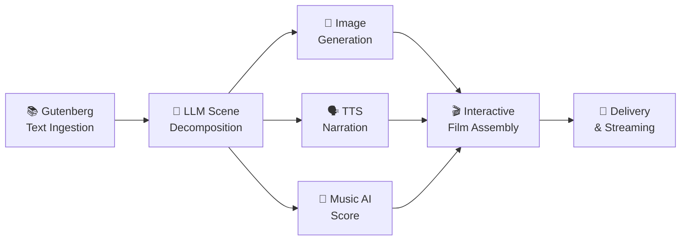

# StoryForge Cinema — Content Generation Workflow & Cost Analysis

> **Objective:** Design the highest-quality, lowest-cost automated pipeline to convert all 75,000+ Project Gutenberg public-domain books into immersive interactive films, starting with ~500 children's books.

---

## 1. Pipeline Architecture Overview

### Per-Book Pipeline Steps

| Step | What It Does | Outputs | Avg. Cost Driver |
|------|-----------|--------|----------------|
| **1. Text Ingestion** | Fetch & clean Gutenberg text, split chapters | Clean chapters array | Free (Gutenberg API) |
| **2. Scene Decomposition** | LLM decomposes chapters into scenes with mood, characters, dialogue, camera direction | ~10–50 scenes per book | LLM tokens |
| **3. Keyframe Generation** | AI diffusion model generates one 8K image per scene | 10–50 images per book | Image API calls |
| **4. Narration** | TTS converts narration text to high-quality speech | 2–60 min audio per book | Character count |
| **5. Music Score** | AI generates mood-matched background music per scene | 10–50 music clips | Track generations |
| **6. Hotspot Overlay** | LLM generates vocabulary, quiz, explore content per scene | JSON metadata | LLM tokens |
| **7. Assembly** | Combine into interactive film with transitions | Final `.mp4` + metadata | Compute (free/self-hosted) |

---

## 2. Recommended Suppliers (Best Quality : Cost Ratio)

### 🧠 LLM — Scene Decomposition & Hotspot Generation

| Supplier | Model | Input / 1M tokens | Output / 1M tokens | URL | Why |
|----------|-------|------------------:|--------------------:|-----|-----|
| **Google** | Gemini 1.5 Flash | $0.075 | $0.30 | [ai.google.dev/pricing](https://ai.google.dev/pricing) | Cheapest quality model, 1M context window |
| OpenAI | GPT-4o Mini | $0.15 | $0.60 | [platform.openai.com/pricing](https://platform.openai.com/pricing) | Great quality, 2× Flash cost |
| DeepSeek | V3.2-Exp | $0.28 | $0.42 | [deepseek.com](https://deepseek.com) | Strong alternative, low output cost |

> **⭐ Winner: Gemini 1.5 Flash** — Best quality-to-cost ratio for bulk text processing. Free tier: 1,500 req/day.

### 🎨 Image Generation — Keyframe Art

| Supplier | Model | Cost/Image | Quality | URL |
|----------|-------|----------:|---------|-----|
| **Stability AI** | SDXL 1.0 (API) | $0.009 | Good | [platform.stability.ai](https://platform.stability.ai) |
| Stability AI | SD 3.5 Medium | $0.035 | High | [platform.stability.ai](https://platform.stability.ai) |
| **Stability AI** | Stable Image Core | $0.03 | High | [platform.stability.ai](https://platform.stability.ai) |
| Stability AI | Stable Image Ultra | $0.08 | Premium | [platform.stability.ai](https://platform.stability.ai) |
| Black Forest Labs | Flux 2 Schnell | $0.015 | Good | [blackforestlabs.ai](https://blackforestlabs.ai) |
| Black Forest Labs | Flux 2 Pro | $0.05 | Premium | [blackforestlabs.ai](https://blackforestlabs.ai) |
| OpenAI | GPT Image 1 Mini (Low) | $0.005 | Fair | [platform.openai.com](https://platform.openai.com/pricing) |
| OpenAI | GPT Image 1 (Med) | $0.042 | High | [platform.openai.com](https://platform.openai.com/pricing) |
| Google | Imagen 4 Fast | $0.02 | High | [ai.google.dev](https://ai.google.dev/pricing) | **Already integrated — FORGE ready** |
| Google | Imagen 4 Standard | $0.04 | Premium | [ai.google.dev](https://ai.google.dev/pricing) | **Already integrated — FORGE ready** |
| Self-Hosted | SD 3.5 (Open Source) | ~$0.003 | High | [github.com/Stability-AI](https://github.com/Stability-AI/stable-diffusion) | RTX 4090 on-site |

> **⭐ Winner: Imagen 4 Fast ($0.02) as default — already integrated, high quality.**  
> For max volume / cost reduction: Self-hosted SD 3.5 (~$0.003/img) using the RTX 4090.  
> Stability AI SDXL ($0.009) is a strong secondary API option.

### 🗣️ TTS — Narration

| Supplier | Model | Cost / 1M chars | Quality | URL |
|----------|-------|----------------:|---------|-----|
| **Google Cloud** | Standard | $4.00 | Good | [cloud.google.com/text-to-speech](https://cloud.google.com/text-to-speech/pricing) |
| **Google Cloud** | Neural2/WaveNet | $16.00 | High | [cloud.google.com/text-to-speech](https://cloud.google.com/text-to-speech/pricing) |
| Amazon | Polly Standard | $4.00 | Good | [aws.amazon.com/polly/pricing](https://aws.amazon.com/polly/pricing/) |
| Amazon | Polly Neural | $16.00 | High | [aws.amazon.com/polly/pricing](https://aws.amazon.com/polly/pricing/) |
| OpenAI | TTS Standard | $15.00 | High | [platform.openai.com](https://platform.openai.com/pricing) |
| ElevenLabs | Scale Plan | $120/M chars | Premium | [elevenlabs.io/pricing](https://elevenlabs.io/pricing) |

> **⭐ Winner: Google Cloud Neural2 at $16/M chars** — Best narration quality.  
> Free tier: 1M chars/month. Pairs with the $300 Google Cloud credit.

### 🎵 Music AI — Background Scores

| Supplier | Model | Cost/Track | Quality | URL |
|----------|-------|----------:|---------|-----|
| **Suno** | Pro Plan | ~$0.02 | High | [suno.com](https://suno.com) |
| **Udio** | Standard | ~$0.01 | High | [udio.com](https://udio.com) |
| Mubert | API Streaming | $0.01/min | Good | [mubert.com/api](https://mubert.com/api) |

> **⭐ Winner: Udio Standard at ~$0.01/track** — Best quality for price, commercial license included.

---

## 3. Content Volume Estimates

### Gutenberg Catalog Breakdown

| Category | Estimated Titles | Avg Word Count | Avg Scenes | Avg Images | Avg Narration Chars |
|----------|----------------:|---------------:|----------:|----------:|--------------------:|
| **Children's Picture Books** | ~130 | ~3,000 | 8 | 8 | 15,000 |
| **Children's Chapter Books** | ~370 | ~15,000 | 20 | 20 | 75,000 |
| **Children's Total** | **~500** | — | — | — | — |
| Classic Novels | ~8,000 | ~60,000 | 40 | 40 | 300,000 |
| Epic / Long Works | ~3,000 | ~150,000 | 80 | 80 | 750,000 |
| Poetry / Short Works | ~15,000 | ~5,000 | 10 | 10 | 25,000 |
| Non-Fiction / Other | ~49,000+ | ~30,000 | 25 | 25 | 150,000 |
| **Grand Total** | **~75,000+** | — | — | — | — |

---

## 4. Cost Estimates — RECOMMENDED TIER (Optimal Quality:Cost)

### Tier A: First 100 Children's Books

> A mix of ~40 picture books (short) and ~60 chapter books (longer).

| Pipeline Step | Supplier | Unit Cost | Volume | Subtotal |
|--------------|----------|----------:|-------:|---------:|
| Text Ingestion | Gutenberg | Free | 100 books | **$0** |
| Scene Decomposition (LLM) | Gemini 1.5 Flash | $0.075 in / $0.30 out per 1M | ~4M tokens | **$0.90** |
| Keyframe Images | Imagen 4 Fast | $0.02/image | ~1,560 images | **$31.20** |
| Narration (TTS) | Google Cloud Neural2 | $16/M chars | ~5.1M chars | **$81.60** |
| Music Scores | Udio Standard | $0.01/track | ~1,560 tracks | **$15.60** |
| Hotspot Content (LLM) | Gemini 1.5 Flash | $0.075 in / $0.30 out per 1M | ~2M tokens | **$0.45** |
| Assembly Compute | Self-hosted | — | — | **$0** |

| | |
|--|--:|
| **Total for 100 Children's Books** | **~$129.75** |
| **Average per book** | **~$1.30** |

> **Note:** With Google Cloud's $300 credit, the first TTS batch (~$81.60) is effectively free.

### Tier B: All ~500 Children's Books

| Pipeline Step | Volume | Subtotal |
|--------------|-------:|---------:|
| Scene Decomposition | ~20M tokens | **$4.50** |
| Keyframe Images (Imagen 4 Fast) | ~7,400 images | **$148** |
| Narration (TTS Neural2) | ~24M chars | **$384** |
| Music Scores | ~7,400 tracks | **$74** |
| Hotspot Content | ~10M tokens | **$2.25** |

| | |
|--|--:|
| **Total for ~500 Children's Books** | **~$612.75** |
| **Average per book** | **~$1.23** |

### Tier C: Full Gutenberg Catalog (~75,000 Books)

| Pipeline Step | Volume | Subtotal |
|--------------|-------:|---------:|
| Scene Decomposition | ~3B tokens | **$675** |
| Keyframe Images (Imagen 4 Fast) | ~2.25M images | **$45,000** |
| Narration (TTS Neural2) | ~7.5B chars | **$120,000** |
| Music Scores | ~2.25M tracks | **$22,500** |
| Hotspot Content | ~1.5B tokens | **$337.50** |

| | |
|--|--:|
| **Total for ~75,000 Books** | **~$188,512** |
| **Average per book** | **~$2.51** |

### Self-Hosted Maximum Savings Tier

> RTX 4090 on-site for images. Google Standard TTS ($4/M). Udio credits for music.

| | 100 Children's | 500 Children's | 75,000 All |
|--|--:|--:|--:|
| Images (self-hosted ~$0.003) | $4.68 | $22.20 | $6,750 |
| TTS (Google Standard $4/M) | $20.40 | $96 | $30,000 |
| Music (Udio ~$0.01) | $15.60 | $74 | $22,500 |
| LLM (Gemini Flash) | $1.35 | $6.75 | $1,012 |
| **Total** | **$42** | **$199** | **$60,262** |

---

## 5. Production Timeline

| Phase | Scope | Est. Timeline | Notes |
|-------|-------|:-------------|-------|
| **Phase 1** | First 5 pilot books (Phase 1 E-16 titles) | 1–2 weeks | Manual QA on all 5 |
| **Phase 2** | First 100 children's books | 2–4 weeks | Automated pipeline, spot-check QA |
| **Phase 3** | Remaining ~400 children's books | 4–6 weeks | Fully automated, weekly QA |
| **Phase 4** | 8,000 classic novels | 3–6 months | Batch processing |
| **Phase 5** | Full 75,000 catalog | 6–12 months | Continuous pipeline |

---

## 6. FORGE Integration Status

| Capability | Module | Status |
|---|---|---|
| `audiobook.text` | `forge/audiobooks/chapter-text-service.ts` | production ✅ |
| `audiobook.tts` | `forge/audiobooks/audiobook-tts-service.ts` | production ✅ |
| `image.google-imagen` | `forge/media/google-ai-client.ts` | **ready ✅** — `npm run media:batch:storyforge` |
| `video.google-veo` | `forge/media/google-ai-client.ts` | ready ✅ — DEFERRED (see cost note) |
| `storyforge.scene-decomp` | `forge/storyforge/scene-decomp.ts` | **planned** |
| `storyforge.tts` | `forge/audiobooks/audiobook-tts-service.ts` | reuse existing ✅ |
| `storyforge.music-score` | `forge/storyforge/music-score.ts` | **planned** |

> **Veo note:** 100 scenes × $0.60 = $60 for Phase 1 (5 books). Use static + pan-zoom Imagen frames first.  
> Veo cinematic clips are a Tier 2 upgrade once Phase 1 books are validated.

---

## 7. Quality Assurance Strategy

1. **Automated validation**: Scene count ≥ 5, narration length matches scene duration, image success rate > 98%.
2. **Human QA (first 5 books)**: Manual review of scene transitions, mood accuracy, hotspot relevance.
3. **Community moderation**: Users can flag quality issues via in-app reporting after launch.
4. **A/B testing**: Test Imagen 4 vs Stability SDXL quality on 20 titles, measure user dwell time.

---

## 8. Key Supplier URLs

| Service | URL |
|---------|-----|
| Project Gutenberg | [gutenberg.org](https://www.gutenberg.org) |
| Google AI (Gemini + Imagen + TTS) | [ai.google.dev](https://ai.google.dev) |
| Stability AI | [platform.stability.ai](https://platform.stability.ai) |
| Black Forest Labs (Flux) | [blackforestlabs.ai](https://blackforestlabs.ai) |
| Udio Music AI | [udio.com](https://udio.com) |
| Suno Music AI | [suno.com](https://suno.com) |
| ElevenLabs | [elevenlabs.io](https://elevenlabs.io) |
